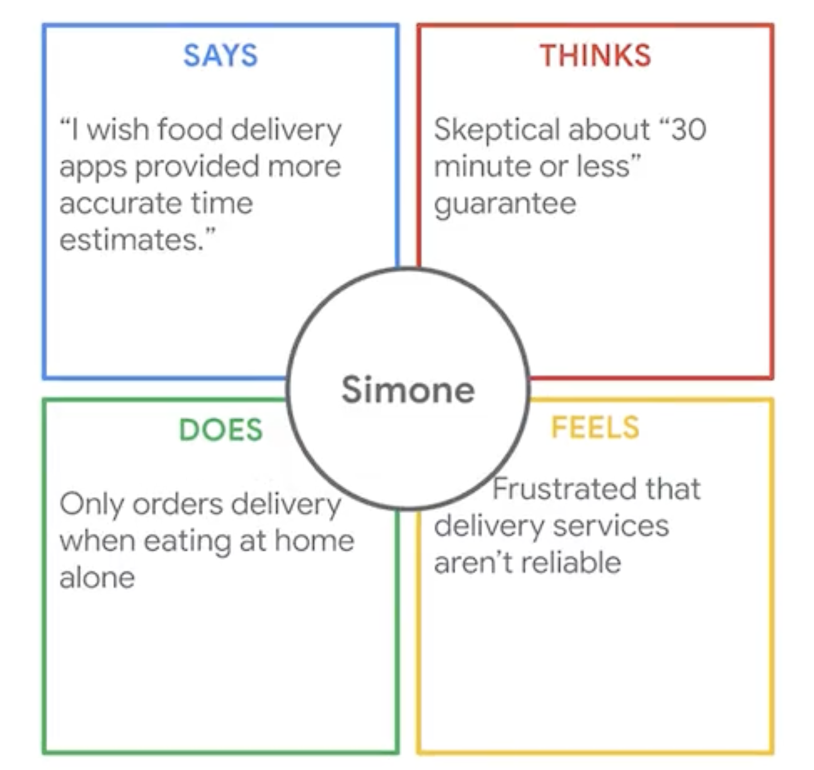
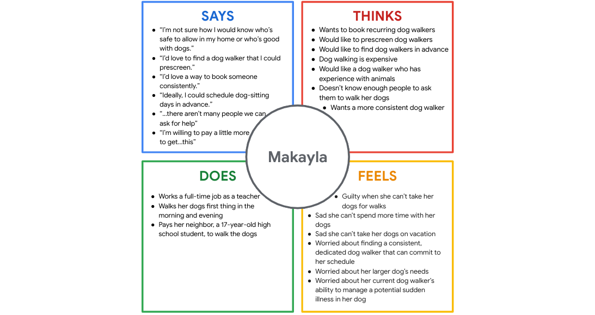

## Portfolio site

3 website builders:

- Wix: Easy to use, lots of templates.
- Squarespace: More attractive themes?
- Webflow: High customisation, but allows coding?

Good portfolio:

- Personal brand: Personality / unique skills / values intersect with public persona.
- Tell a story: Especially for cast studies
- Be concise
- Keep navigation simple & intuitive
- Go beyond the template
- Include diverse projects, 3-6 across different facets
- Feature case studies: Lead through design process from beginning to end
- Make sure site is responsive to screen size
- Test!

## Empathising with users

When it comes to empathy and similar words like pity and sympathy, the meanings can sometimes get a little blurry.

- Pity: Feeling sorry for someone.
- [Sympathy] Feeling `for` someone: Acknowledging someone’s feelings without necessarily wanting to experience them yourself.
- [Empathy] Feeling `with` someone: Sharing in another person’s mental and emotional experience.

How to empathize:

- Ask lots of questions
- Become more observant
- Be an active listener
- Request input
- Have an open mind
- Keep current on UX research

Empathy maps:

- Chart that explains everything designer / team has learned about a type of user.
- Everything the user says, does, thinks, feels
- Can be either a single user, or a group of similar users (aggregated)

## Interviews

Screener survey: Detailed list of questions to determine if potential participants meet requirements of study.

Interview goals (verbatim):

- Who are you users and what problems or needs is your product aiming to solve?
- What do you want to learn from the interviews?
- Are there certain user problems or pain points that you need to empathize with?
- Are there any characteristics of users you want to interview?
- Why?
- How much information should we have to ensure we get a comprehensive and balanced set of data?

The participant characteristics

- Who are your end users and what are their **key characteristics**? Key characteristics include things like age, location, career, gender, disability, and so on.
- How might these characteristics **shape users' experiences** with or **feelings** about my product or similar products?

Good interview questions are:

- Relevant
- Open-ended
- Clear
- Neutral
- Designed for follow up

Preparing for interview:

- Script questions: Should be the same for all users
- Collect supplies: E.g. recording equipment, a printed list of your questions
- Research the users (e.g. job, age, anything relevant such as personal network, existing user base, online, hallway testing, third-party recruiting agencies)

Steps in an interview:

1. Meet & relax the participant
   - Build a good rapport
   - Thank them for coming
   - Review legal details (e.g. recording)
   - Gather basic details: Starting with easy
   - Let participant known no correct / incorrect answers
2. Conduct interview
   - Speak clearly and professionally (duh!)
   - Asking yes or no questions doesn't allow your participant to tell their honest thoughts on your product. Instead, try asking questions that start with why or what.
   - Ask open-ended questions, e.g. not "do you like x", but "what do you like and dislike about x"
3. Take notes
   - Highlight compelling quotes
   - Document observations about participant (e.g. body language)
   - Consider recording interviews
4. Wrap up the interview
   - Give user a chance to share final thoughts
   - Remember to thank participants once more.

## Empathy map

An empathy map is an easily-understood chart that explains everything designers have learned about a type of user. An empathy map consists of four squares which show what the user says, does, thinks, and feels.

or use this scenario [Makayla-Interview-transcript-Exemplar.docx](../files/Google-UX-Design-Certificate---Makayla-Interview-transcript-Exemplar.docx). we will have this sample empathy map

## Pain points

Pain points are any UX issues that frustrate the user and block the user from getting what they need.

Types of pain points:

- Financial: E.g. price
- Product: Often quality issues, or unintuitive
- Process: Struggling with actual process from point A to B
- Support: Customer service help

When you can identify user pain points, you can develop more meaningful solutions. Get started by distinguishing pain points from solutions.

- Solution: A solution attempts to address a pain point, either by remedying the pain point or the root cause of the pain point.

## Personas

User group: A set of people who have similar interests, goals, or concerns.

Benefits:

- Builds empathy: Humanises the users
- Tell stories: Helps you predict a user's needs
- Stress-test designs: Does a change work for all personas?
- Help to build user story

Personas are created by conducting user research and identifying common pain points, which are UX issues that frustrate and block the user from getting what they need from a product.

To review a persona

- **Demographic information**: Did the demographic information match the persona characteristics given in the activity directions?
- **Quote**: Were you able to imagine a quote that is relevant to the persona and the background you’ve built for them?
- **Goals/frustrations**: Were the goals and frustrations aligned with the persona and the activity scenario?
- **Brief story/scenario**: Were you able to give more information about the persona, tying in their goals and frustrations, as well as their quote?
- **Image**: Did you include a picture or avatar representing the personas for your activity?

View sample persona [here](../files/sample-personas/).

## Feedback

- Linking to actual case studies was interesting!
  - <https://design.google/library/reimagining-google-fonts/>
  - <https://design.google/library/exploring-color-google-maps/>
- Timing is WAY more accurate this time. 10m of reading is about 10m.

## Reference

- https://www.usertesting.com/
- https://www.userinterviews.com/
- Nielsen Norman Group, [Empathy Mapping: The First Step in Design Thinking](https://www.nngroup.com/articles/empathy-mapping/)
- Just In Mind, [60 must-see user persona templates](https://www.justinmind.com/blog/user-persona-templates/)
- Xtensio, [User Persona Template](https://xtensio.com/user-persona-template/)
- Interaction Design Foundation, [Personas – A Simple Introduction](https://www.interaction-design.org/literature/article/personas-why-and-how-you-should-use-them)
