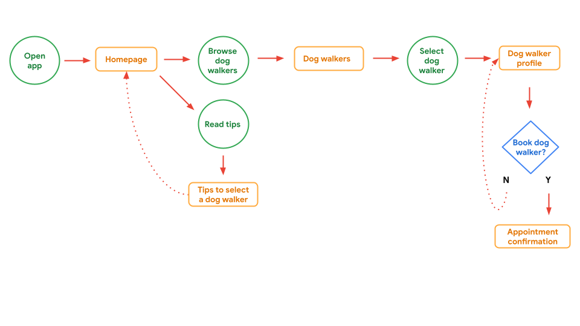

# Module 1: 1 Storyboarding and wireframing

## Contents (TOCS)

```md
- Introduce to Course 3
- Outline user flows
- Create storyboards
- Get started with wireframes
- Module 1 review
```

## Prototypes

Purpose:

- The actions the product is doing at any given point
- The interactive elements
- How the product will function when it’s live

Benefits:

- Turn a concept into reality
- Work through a problem
- Iterate designs based on research and feedback
- Detect unintended scenarios and usability problems
- Present more easily to stakeholders
- Test before development and launch

Project goals:

- What are the goals of the project?
- What competitive products are currently used?
- Who is the audience, and what are their goals?
- What type of product is it, and what (device) is it for?
- Are there any visual precedents to follow?
- What are the deliverables?

## User flows

Path taken by a typical user so they can complete a task from start to finish.

The goal is to map how users achieve a specific goal as they move through a product. That way, we have a clear overview of the product's functionality before the design process begins.

Shapes (same as typical flow chart):

- Circle: Action
- Rectangle: Screen
- Diamond: Decision
- Lines: Direction



## Storyboard

A series of panels / frames that visually describe and explore a user's experience with a product.

Storyboarding is a tool for making a strong visual connection between the insights you uncovered during research and the flow of the experience.

4 elements:

- Character: The user
- Scene: User's environment
- Plot: Benefit or solution of design
- Narrative: The user's need or problem and how the design solves it

Two types:

- Big picture: Focuses on the user experience (user needs), how product will be used throughout the day, why it's useful, etc. "How & why".
- Close-up: Focuses on the product itself, what happens on screens, transitions, flow. "What".

Typically, you want big picture for early on, to get buy in, overall experience. Later on, you'll want close-up to get details within the app.

## Wireframes

`Fidelity` means how closely a design matches the look-and-feel of the final product.

- use low-fidelity designs when we want to get ideas out quickly and leave room for exploration.
- use high-fidelity designs when we want to test a design that looks like a real product and get more specific feedback from users.

Why:

- Establish basic structure of a page
- Highlight the intended function of the product
- Save time and resources

Benefits:

- Inform the elements that should be included
- Help catch problems early
- Get stakeholders to focus on structure not actual details
- Save time & effort since everyone is roughly in sync from the start
- Can iterate quickly

Common standards:

- Text: Horizontal lines
- Images / icons: Circle with x in
- CTA: Rectangle / circle

## Review storyboards

As you review, answer these questions:

- Are all parts of the big-picture storyboard template filled out?
- Are the big-picture storyboard sketches clearly focused on the user?
- Do the big-picture storyboard sketches clearly indicate the environment or context where the user is located?
- Do the big-picture storyboard sketches clearly focus on the specific need or pain point experienced by the user?
- Are all parts of the close-up storyboard template filled out?
- Do the close-up storyboard sketches clearly focus on the product, instead of on the user experiencing that product?
- Do the close-up storyboard sketches clearly indicate the interaction that a user may have with the product (for example, do the sketches depict sample screens)?
- Do the close-up storyboard sketches indicate any transitions between screens or states that the user may need to perform?
